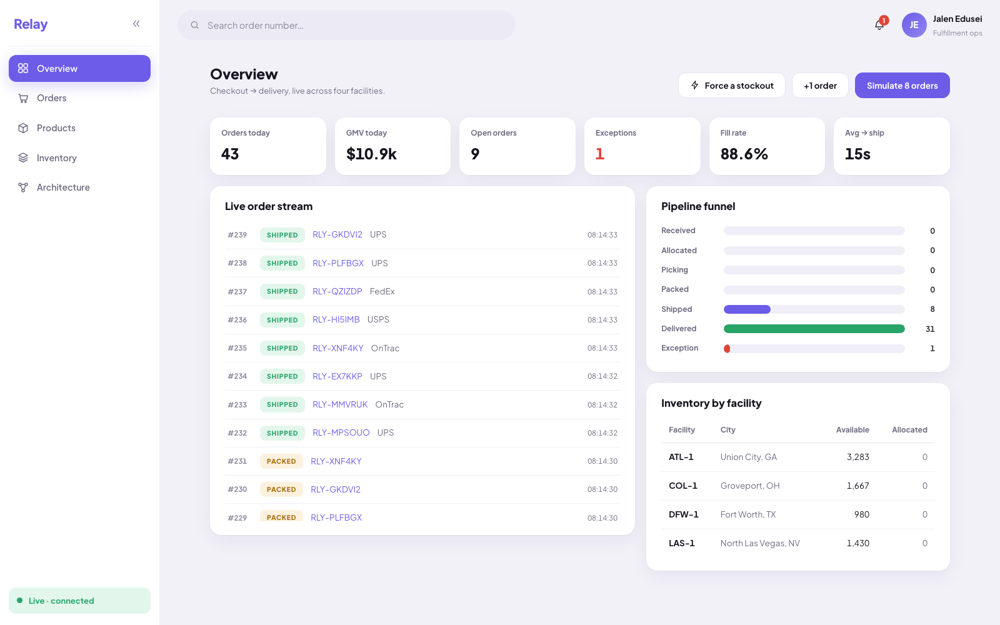

# Relay

An order management system: the software that runs between "customer clicks buy" and "box arrives
at the door". Orders arrive over an API, the system reserves stock at one of four warehouses, walks
each order through picking, packing, shipping and delivery, and shows an operations team the whole
thing moving live.



## What problem this solves

Two things go wrong in order systems, and both cost real money.

**Overselling.** Two customers click buy at the same instant on the last 8 units of a product with
12 in stock. If the system reads the count, decides, and writes back without coordinating, both
requests read "12 available", both reserve 8, and the warehouse has now promised 16 units it does
not have. Someone gets an apology email and a refund, and a picker walks to an empty shelf.

**Duplicate orders.** A customer double-clicks Place Order. Or their phone loses signal mid-request
and the app retries on its own. Without protection that is two orders, two charges, two boxes, and a
support ticket.

Neither problem is hard in the abstract. Both are easy to get wrong under load, and both fail
silently until a human notices. Relay is built around the two mechanisms that prevent them, and
everything else in the repo exists so you can watch those mechanisms work.

**How Relay handles the first.** Allocation locks every relevant inventory row in Postgres
(`SELECT ... FOR UPDATE`) *before* it reads a single count. The second order does not get to read a
stale number. It waits for the first to commit, sees 4 units remaining, cannot cover the line, and
fails cleanly into an `exception` lane where an operator can restock and retry. A database check
constraint named `allocated_within_on_hand` (literally `allocated <= on_hand`, in migration
`20260721100003`) is the last line of defense: a bug that slips past the locks becomes a loud
constraint violation instead of silent corruption.

**How Relay handles the second.** Create requests carry an `Idempotency-Key` header. The column has
a unique index, so the retry either finds the original order on lookup or loses the insert race and
is caught by the constraint. Either path returns the original order with HTTP 200 and
`meta.idempotent_replay: true`, instead of HTTP 201 and a second box.

## How it works

An order's whole life, from the API call to the browser update:

```
POST /api/v1/orders
        |
        v
  [ one transaction ]  insert order (status: received)
                       insert line items
                       insert order_events row  <-- the event and the state change
        |                                            commit together, or neither does
     commit
        |
        v
  broadcast on PubSub (only after commit, so nobody sees a rolled-back event)
        |
        +---------------------------> DashboardChannel --> browser (live)
        |
        v
  Fulfillment.Pipeline (async worker, subscribes to the same stream)
        |
        v
  allocate -> picking -> packed -> shipped -> delivered
  (each step: lock the order row, check the state machine, write, append an event, broadcast)
```

The pieces, and where they live:

- **[`orders/workflow.ex`](backend/lib/relay/orders/workflow.ex)** is the only code that writes order
  state. Every function follows one contract, built on `Ecto.Multi`: the status change and the event
  describing it commit in a single transaction, and the broadcast happens after commit. This is the
  transactional outbox pattern, meaning the event log is written inside the same transaction as the
  data it describes, so the two can never disagree. There is no code path that changes an order
  without recording why.
- **[`orders/state_machine.ex`](backend/lib/relay/orders/state_machine.ex)** is 8 states (`received`,
  `allocated`, `picking`, `packed`, `shipped`, `delivered`, `exception`, `cancelled`) and 11 legal
  moves between them, declared as one map. Cancellation is allowed until `packed`. After that the box
  has left. An `exception` order can go back to `received` (retry) or be cancelled.
- **[`inventory.ex`](backend/lib/relay/inventory.ex)** is the only code that touches stock counts,
  and it only runs inside a transaction. See the next section.
- **[`fulfillment/pipeline.ex`](backend/lib/relay/fulfillment/pipeline.ex)** is the async worker.
  See the section after that.
- **[`relay_web/channels/dashboard_channel.ex`](backend/lib/relay_web/channels/dashboard_channel.ex)**
  pushes to the browser. The React console is just one more subscriber to the same event stream the
  worker consumes.
- **[`relay_web/controllers/api/fallback_controller.ex`](backend/lib/relay_web/controllers/api/fallback_controller.ex)**
  is one place that turns domain errors into HTTP status codes, so controllers stay thin. An illegal
  state move becomes HTTP 409 with `{"error": {"code": "invalid_transition", ...}}` at line 31.

### The part worth reading: a worker that survives being killed

`Fulfillment.Pipeline` is a GenServer that advances orders on timers with a little jitter, standing
in for the real warehouse signals (a picker scanning a tote, a carrier webhook) that a production
system would receive instead.

Timers are process-local. That is the whole problem. If that worker dies, every in-flight order is
stranded at whatever state it reached, and, worse, the stock those orders reserved stays reserved
forever. Nobody is coming to release it. The warehouse quietly loses inventory it still physically
has.

So `init/1` returns `{:continue, :rehydrate}`, and `handle_continue(:rehydrate, ...)` scans the
database for every non-terminal order and reschedules its next step from the order's current status
rather than from an event. Restarts strand nothing. This is the same reason a Kafka consumer tracks
offsets and resumes from the log on boot.

The subtle part is what makes rehydration safe rather than dangerous. Rehydration races live events:
a rehydrated timer and a freshly broadcast event can both try to advance the same order. Relay does
not coordinate them. It does not need to, because every transition re-reads the order under a row
lock and re-validates against the state machine, so the duplicate advance simply loses with
`{:error, {:invalid_transition, from, to}}` and drops out. The same guard handles a picking timer
that fires after a cancellation. The state machine is the authority, not the timer. There are no
compensating writes and no "check if cancelled" flags sprinkled through the code.

### Allocation: lock first, then decide

`Inventory.allocate_within_txn/2` locks **all** candidate rows for the order's products before
reading any counts, then picks a facility in two passes: prefer one in the destination's shipping
zone (a Georgia order goes to ATL-1), then break ties by deepest available stock. It requires a
single facility that can cover every line item. Splitting an order across facilities is a deliberate
non-feature, because multi-shipment orders are real complexity that would obscure the locking, which
is the interesting part.

Stock moves in three phases so the arithmetic stays truthful across the whole lifecycle: allocation
reserves (`allocated += qty`), shipping consumes (`on_hand -= qty, allocated -= qty`), cancellation
releases.

## Results

Everything below is a count or a fact you can check in the repo. There are no performance numbers,
for the reason given at the end of this section.

| Fact | Value | Where |
| --- | --- | --- |
| Backend tests | 39 ExUnit tests | 19 order controller, 14 workflow, 2 pipeline, 2 dashboard channel, 2 error JSON |
| Frontend tests | 13 Vitest tests | `frontend/src/{format,api/client,components/StatusChip}.test.*` |
| API surface | 13 JSON routes | [`router.ex`](backend/lib/relay_web/router.ex) (a 14th, Phoenix LiveDashboard, is dev-only) |
| Order lifecycle | 8 states, 11 legal transitions | [`state_machine.ex`](backend/lib/relay/orders/state_machine.ex) |
| Fulfillment network | 4 facilities: ATL-1, LAS-1, COL-1, DFW-1 | [`seeds.exs`](backend/priv/repo/seeds.exs) |
| Frontend source | 2,245 lines across 22 TypeScript files | `frontend/src`, `tsc` in strict mode |
| Deployment artifacts | 2 Dockerfiles, 5 Kubernetes manifests | `backend/`, `frontend/`, `deploy/k8s/` |

CI runs on every push and pull request: `mix format --check-formatted`, `mix compile
--warnings-as-errors`, and `mix test` for the backend; oxlint, `tsc -b`, Vitest, and a production
build for the frontend. See [`.github/workflows/ci.yml`](.github/workflows/ci.yml).

**The oversell test is sequential, not concurrent.** This matters, so it is worth being exact.
[`workflow_test.exs:107`](backend/test/relay/orders/workflow_test.exs) ("second order for the last
units loses cleanly") stocks 12 units, creates two orders for 8 each, then allocates the first and
the second **in the same process, one after the other**. It proves the decision logic and the
accounting: the second order lands in `exception`, and `allocated` reads 8, never 16. It does **not**
exercise concurrent lock behavior, because nothing runs concurrently. The `FOR UPDATE` locking is
there and is the correct mechanism, but this suite does not prove it under a real race. A test that
did would need two processes contending on the same rows against a shared (non-sandboxed) connection.

**No load testing exists.** Grepping this repo for k6, artillery, wrk, locust, RPS, p95, or
"throughput" returns nothing. There are no requests-per-second numbers, no latency percentiles, and
no profiling artifacts, so none are claimed anywhere in this README.

**Not deployed anywhere.** [`docs/ARCHITECTURE.md:104`](docs/ARCHITECTURE.md) carries a table titled
"What's honest and what's a prop" that separates the load-bearing parts (the API, Ecto and Postgres,
the locks and constraints, the outbox, the channel, the test suite) from the props (the Kubernetes
manifests, which are correct but have never been applied; the timers standing in for warehouse
signals; `Simulate` standing in for Shopify and Amazon webhooks). That table is the honest accounting
and it stays.

## Running it

Prerequisites: Elixir 1.17 or newer, Node 20 or newer, and a PostgreSQL server running locally. CI
pins Elixir 1.20 with OTP 28, Node 22, and Postgres 16.

```sh
# backend, terminal 1
cd backend
mix setup            # fetch deps, create the DB, migrate, seed
mix phx.server       # API on http://localhost:4000
```

```sh
# frontend, terminal 2
cd frontend
npm install
npm run dev          # SPA on http://localhost:5173, proxies /api and /socket to :4000
```

A successful run looks like the screenshot at the top of this file: the sidebar shows
"Live, connected", and the six metric tiles are populated. Open http://localhost:5173 and press
**Simulate 8 orders** to see orders move through the pipeline in real time.

To watch the failure path end to end:

1. Press **Force a stockout**. This places an order for 99 units of a deliberately scarce SKU.
   Allocation fails, the order parks in the red `exception` lane, and the topbar bell starts counting.
2. Go to the Inventory page and **receive stock** at the Dallas facility (DFW-1).
3. Open the order and press **Retry allocation**. The timeline records `received (retry)`, then
   `allocated`, `picking`, `packed`, `shipped`, `delivered`, fulfilled from the facility you just
   restocked.

Every step of that is real state in Postgres, real rows in the event log, and the real async worker
doing the moving.

Tests:

```sh
cd backend  && mix test        # 39 tests
cd frontend && npm run test    # 13 tests
cd frontend && npm run lint    # oxlint
cd frontend && npm run typecheck
```

`mix test` creates and migrates the test database first (see the `test` alias in `mix.exs`), so it
works from a clean checkout as long as Postgres is up.

There is also a `docker-compose.yml` that runs Postgres, the Phoenix release, and the SPA behind
nginx. The release runs `Relay.Release.migrate()` before boot, because there is no Mix inside the
container. It is written for machines with Docker and is not the local development path.

## Project layout

```
backend/                    Elixir / Phoenix, API only
├── lib/relay/
│   ├── orders/
│   │   ├── workflow.ex         Every write. Outbox transactions, broadcast after commit
│   │   └── state_machine.ex    8 states, 11 transitions, as one map
│   ├── inventory.ex            Allocation under FOR UPDATE locks, facility selection
│   ├── fulfillment/
│   │   ├── pipeline.ex         The async worker, with boot-time rehydration
│   │   └── zones.ex            Coarse US shipping zones for facility preference
│   ├── events.ex               The outbox table's read and broadcast side
│   ├── metrics.ex              Dashboard rollups, rates read from the event log
│   └── simulator.ex            Demo traffic, pushed through the real pipeline
├── lib/relay_web/
│   ├── router.ex               13 routes
│   ├── controllers/api/        Order, catalog, and ops controllers plus the fallback
│   └── channels/               DashboardChannel
├── priv/repo/migrations/       7 migrations, including the oversell check constraint
└── test/                       39 tests, weighted toward failure modes

frontend/                   React 19, TypeScript in strict mode, Vite
└── src/
    ├── pages/                  Overview, Orders, OrderDetail, NewOrder, Inventory,
    │                           Products, About, NotFound
    ├── realtime/               Phoenix Channel subscription and React Query cache updates
    ├── api/client.ts           Typed fetch wrapper
    └── components/             StatusChip, QueryError, Icons

deploy/k8s/                 5 manifests: backend, frontend, ingress, migration Job,
                            secrets template. Correct, never applied.
docs/ARCHITECTURE.md        The long write-up, including the honesty table
docker-compose.yml          Full stack in containers
.github/workflows/ci.yml    Both CI jobs
```

## API

```
GET  /api/v1/health              Liveness and readiness (pings Postgres)
GET  /api/v1/metrics             Dashboard KPIs
GET  /api/v1/events?limit=50     Recent event stream
POST /api/v1/simulate            {"count": 8}, demo traffic through the real pipeline

GET  /api/v1/products
GET  /api/v1/facilities
GET  /api/v1/inventory
POST /api/v1/inventory/receive   Inbound stock

GET  /api/v1/orders              ?status=&channel=&number=&page=&page_size=
POST /api/v1/orders              Honors Idempotency-Key: 201 on create, 200 on replay
GET  /api/v1/orders/:id          Order plus its full event timeline
POST /api/v1/orders/:id/cancel   Guarded by the state machine (409 if illegal)
POST /api/v1/orders/:id/retry    Sends an exception order back through allocation

WS   /socket, topic dashboard:lobby
```

On the socket: **`order_event` messages push immediately and are not coalesced.** Only the `metrics`
snapshot is debounced, to at most one per 300 ms per connected client. That is the point of the
debounce: a burst of fifty events costs one round of aggregate SQL instead of fifty, while every
individual order still lands in the browser the moment it commits. (An earlier version of this README
described the debounce as "one push per 300 ms" across the board, which was wrong.)

## Status

Runs locally, end to end. 12 commits. Not deployed anywhere, and there is no hosted demo.

Known gaps, in the order I would close them:

- **No concurrency test.** The oversell test is sequential, as described under Results. The most
  valuable single addition to this repo is a test that starts two processes contending for the same
  inventory rows and asserts that exactly one wins.
- **No load testing or profiling.** No throughput or latency figures exist, so none are claimed.
- **The Kubernetes manifests have never been applied.** They are written correctly, including the
  migration Job and a secrets template, but "correct-looking YAML" is not "deployed".
- **Timers stand in for the warehouse.** In a real system the pipeline would advance on signals from
  a warehouse management system and carrier webhooks. The state machine would not change; only the
  thing that triggers a transition would.
- **No authentication.** Neither the API nor the socket is authenticated. The socket's `connect/3`
  callback is where a token check would go.

## Design notes

Built to learn an Elixir, Phoenix, Postgres, and React stack end to end by making the correctness
problems (concurrent allocation, idempotent creates, illegal state moves) the center of the project
rather than an afterthought.

Two decisions worth calling out:

- **Rate metrics read the immutable event log, not current status.** Fill rate counts allocation
  attempts recorded in `order_events` ([`metrics.ex`](backend/lib/relay/metrics.ex)). A cancelled
  order cannot retroactively change how its allocation went, so the historical rates do not drift as
  statuses move on.
- **The event table's `sequence` column is a `bigserial`.** It is monotonic and strictly increasing,
  and gaps appear exactly where transactions rolled back. If this ever moved to Kafka, that column
  already plays the role of a partition offset, so the seam is in the schema rather than only in the
  code. [`docs/ARCHITECTURE.md`](docs/ARCHITECTURE.md) walks through what else would change.

The UI is an original admin-console design (violet and lavender, Plus Jakarta Sans, which is
OFL-licensed and self-hosted).
