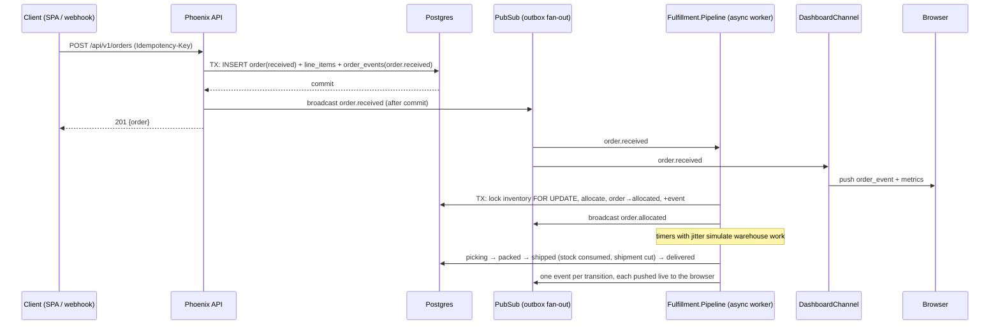

# Relay architecture

Relay is a deliberately small system with production-shaped seams. This doc
walks the life of an order, explains each decision, and is honest about
where the demo diverges from what Stord runs at scale.

## Life of an order

## The event backbone (and the Kafka conversation)

Every write in [`workflow.ex`](../backend/lib/relay/orders/workflow.ex)
follows one contract:

1. **State change and event commit atomically.** The `order_events` row is
   inserted in the same transaction as the order/inventory mutation — the
   transactional outbox pattern. There is no code path that changes state
   without recording why.
2. **Broadcast only after commit.** Subscribers can never observe an event
   whose transaction rolled back.
3. **Consumers react; producers don't call them.** The fulfillment worker
   subscribes to the stream. The API handler that created the order returns
   immediately — it doesn't know allocation exists.

At Relay's scale the transport is `Phoenix.PubSub` inside one BEAM node. At
Stord's scale you'd point a relay process (Debezium, or a poller) at
`order_events` and produce to Kafka; each consumer becomes a service with a
consumer group and its own offset. `sequence` (a `bigserial`) already plays
the role of the partition offset — total order, gapless per producer,
replayable from any point. **The seam is in the schema, not just the code.**

Orders are also event-sourced in the practical sense: the detail page's
timeline is a `SELECT * FROM order_events WHERE order_id = ... ORDER BY
sequence` — not a reconstruction from logs.

## Allocation: correctness under concurrency

[`Inventory.allocate_within_txn/2`](../backend/lib/relay/inventory.ex) is
the only code that touches stock counts, and it only runs inside a
transaction:

- Locks **all** candidate rows for the order's products with
  `SELECT … FOR UPDATE` *before reading counts*, so two orders racing for
  the last units serialize at Postgres. The loser re-reads decremented
  stock and gets `{:error, :insufficient_stock}` — the order parks in
  `exception` instead of overselling.
- Chooses a **single facility that can cover every line item**, preferring
  the destination's shipping zone (GA order → ATL-1), then depth of stock.
  Splitting across facilities is a deliberate non-feature: multi-shipment
  orders are real OMS complexity, and the single-facility rule keeps the
  demo explainable while still exercising the interesting locking.
- Ships in two phases: allocation reserves (`allocated += qty`), shipping
  consumes (`on_hand -= qty, allocated -= qty`), cancellation releases.
  Inventory arithmetic stays truthful over the whole lifecycle.
- The DB backstops everything with check constraints
  (`allocated <= on_hand`, both `>= 0`) — a bug that slips past the locks
  becomes a loud constraint violation, not silent corruption.

## The state machine is the authority

The fulfillment worker advances orders on jittered timers — which means
timers race cancellations constantly. That's on purpose. Every transition
re-reads the order under a row lock and validates against
[`state_machine.ex`](../backend/lib/relay/orders/state_machine.ex); a stale
timer firing after a cancel gets `invalid_transition` and drops out. No
compensating writes, no "check if cancelled" flags sprinkled around.

Cancellation is allowed until `packed` — after that the box ships. An
`exception` order can be retried (→ `received`, which re-enters the
pipeline) or cancelled.

## What's honest and what's a prop

| Real and load-bearing | Prop, labeled as such |
|---|---|
| Phoenix API, Ecto/Postgres, locks, constraints | `deploy/k8s/*` — correct manifests, not applied locally |
| Outbox + async consumer + Channels | `docker-compose.yml` / Dockerfiles — written for Docker-equipped machines |
| Failure-mode test suite | Timers standing in for WMS pick/pack/carrier signals |
| CI (runs on every push) | `Simulate` standing in for channel webhooks (Shopify/Amazon) |

## What changes at Stord scale

- **PubSub → Kafka**, consumers → services (allocation, notifications,
  analytics) with consumer groups and DLQs; the outbox table gains a relay.
- **Timers → real signals** from the WMS floor and carrier webhooks; the
  state machine stays exactly where it is.
- **One Postgres → Cloud SQL** with read replicas; `order_events` partitioned
  by time; metrics move to BigQuery instead of live aggregates.
- **Allocation policy** grows real transit-time rating, split shipments,
  backorder queues — behind the same `allocate_within_txn` seam.
- **Auth** on the socket and API (the `connect/3` callback is where the JWT
  check goes), rate limits, tracing (OpenTelemetry → Datadog).
